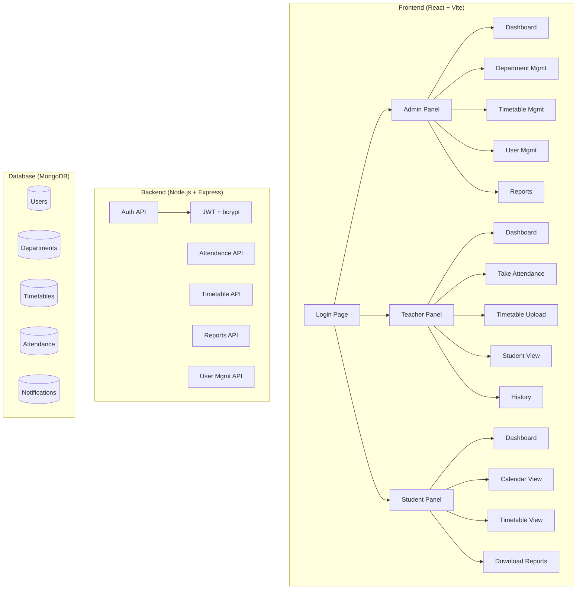

# Student Attendance Management System — Implementation Plan

## Goal
Build a complete **Student Attendance Management System** with institutional UI inspired by the MAKAUT University portal, designed entirely using **Stitch** and then assembled into a full-stack web application.

---

## User Review Required

> [!IMPORTANT]
> This is a **massive** project with 15+ unique screens. The Stitch design phase alone will involve generating each screen individually. I propose a **phased approach** so you can review designs before I build the full app.

> [!WARNING]
> Stitch generates static HTML/CSS screens. The functional backend (JWT auth, database, file export) will be built separately after the design phase. The Stitch screens serve as the **design source of truth** that the React components will replicate.

---

## Open Questions

1. **Database preference**: The prompt mentions PostgreSQL or MongoDB. Which do you prefer? (I'll default to **MongoDB** with Mongoose for faster prototyping.)
2. **Deployment target**: Do you want Docker setup, or is local dev enough for now?
3. **MAKAUT portal reference**: Should I match the exact MAKAUT blue (#003366 / #0056b3) institutional color scheme, or a modern interpretation?
4. **Priority screens**: Should I design ALL 15+ screens in Stitch first, or start with the 5 most important ones (Login, Admin Dashboard, Teacher Attendance, Student Dashboard, Reports)?

---

## Architecture Overview



---

## Phase 1: Stitch Design System & Screen Generation

### Step 1.1 — Create Stitch Project
- Create a new Stitch project titled **"MAKAUT Attendance System"**
- Device type: **DESKTOP** (responsive)

### Step 1.2 — Define Design System
Create a MAKAUT-inspired institutional design system:

| Token | Value | Purpose |
|-------|-------|---------|
| **Primary** | `#0056b3` (MAKAUT Blue) | Buttons, links, active states |
| **Secondary** | `#28a745` (Success Green) | Safe attendance ≥75% |
| **Tertiary** | `#dc3545` (Danger Red) | Low attendance <65% |
| **Warning** | `#ffc107` (Amber) | Warning zone 65-74% |
| **Background** | `#f4f6f9` (Light Grey) | Page backgrounds |
| **Surface** | `#ffffff` (White) | Cards, panels |
| **Color Mode** | Light | Institutional / professional |
| **Font** | Inter | Clean, sans-serif |
| **Roundness** | 8px | Subtly rounded, professional |

### Step 1.3 — Generate Screens (15 screens)

Each screen will be generated with an enhanced prompt following the `enhance-prompt` skill guidelines:

#### Screen List

| # | Screen Name | Role | Key Components |
|---|------------|------|----------------|
| 1 | **Login Portal** | All | Split-panel, 3-tab login (Student/Teacher/Admin), university branding |
| 2 | **Admin Dashboard** | Admin | KPI cards, attendance summary chart, low-attendance alerts |
| 3 | **Department Management** | Admin | Data table with CRUD, department cards |
| 4 | **Timetable Management** | Admin | Weekly grid builder, drag-and-drop slots |
| 5 | **User Management** | Admin | Student/Teacher lists, bulk import, search/filter |
| 6 | **Admin Reports** | Admin | Filterable attendance reports, export options |
| 7 | **Teacher Dashboard** | Teacher | Today's classes, pending attendance, quick stats |
| 8 | **Take Attendance** | Teacher | Digital attendance sheet, checkboxes, mark all |
| 9 | **Teacher Timetable** | Teacher | Visual weekly grid, edit/upload |
| 10 | **Teacher Student View** | Teacher | Per-student attendance breakdown |
| 11 | **Student Dashboard** | Student | Circular progress, subject-wise breakdown, 75% calculator |
| 12 | **Attendance Calendar** | Student | Monthly calendar with color-coded days |
| 13 | **Student Timetable** | Student | Read-only weekly timetable |
| 14 | **Notifications Panel** | All | Alert list with severity indicators |
| 15 | **Forgot Password** | All | OTP flow, step-by-step reset |

---

## Phase 2: Full-Stack Application Build

### Step 2.1 — Frontend (React + Vite + Tailwind CSS)

#### [NEW] Project Structure
```
attendance-system/
├── client/                    # React frontend
│   ├── src/
│   │   ├── components/        # Reusable UI components
│   │   │   ├── Layout/        # Sidebar, Header, Footer
│   │   │   ├── Charts/        # Recharts wrappers
│   │   │   ├── Tables/        # DataTable with pagination
│   │   │   └── Forms/         # Input fields, selects
│   │   ├── pages/
│   │   │   ├── Login.jsx
│   │   │   ├── admin/         # All admin screens
│   │   │   ├── teacher/       # All teacher screens
│   │   │   └── student/       # All student screens
│   │   ├── context/           # Auth context, Theme context
│   │   ├── hooks/             # Custom hooks
│   │   ├── utils/             # API helpers, formatters
│   │   └── App.jsx
│   └── package.json
├── server/                    # Express backend
│   ├── models/                # Mongoose schemas
│   ├── routes/                # API routes
│   ├── middleware/            # Auth, RBAC middleware
│   ├── controllers/           # Business logic
│   ├── seeds/                 # Demo data seeder
│   └── server.js
├── .env
├── docker-compose.yml
└── README.md
```

### Step 2.2 — Backend (Node.js + Express + MongoDB)

#### Database Models
- **User**: name, email, password, role, department, semester, rollNumber
- **Department**: name, code, HOD
- **Subject**: name, code, department, semester, teacher
- **Timetable**: department, semester, section, slots[]
- **AttendanceSession**: subject, teacher, date, timeSlot, students[]
- **Notification**: user, message, type, read, createdAt
- **LeaveRequest**: student, date, reason, document, status, approvedBy

#### API Endpoints
- `POST /api/auth/login` — JWT login
- `POST /api/auth/forgot-password` — OTP generation
- `GET /api/admin/dashboard` — Dashboard stats
- `CRUD /api/admin/departments`
- `CRUD /api/admin/users`
- `CRUD /api/timetable`
- `POST /api/attendance/mark` — Teacher marks attendance
- `GET /api/attendance/student/:id` — Student attendance
- `GET /api/reports/export` — Excel/PDF export

### Step 2.3 — Key Features Implementation

| Feature | Library | Notes |
|---------|---------|-------|
| Charts | Recharts | Bar, Pie, Line charts |
| Data Tables | Custom | Pagination, search, sort |
| Calendar | Custom | Monthly view with color coding |
| Excel Export | xlsx | Attendance sheets |
| PDF Export | jsPDF | Formatted reports |
| Dark/Light Mode | CSS Variables | Toggle via context |
| Toast Notifications | react-hot-toast | Success/error/warning |

---

## Phase 3: Polish & Deploy

- Responsive design testing
- Dark/light mode toggle
- Seed data for demo
- README with setup instructions
- Docker compose (optional)

---

## Verification Plan

### Automated Tests
- Run `npm run build` to verify no build errors
- Run the dev server and visually verify each page

### Manual Verification
- Open each screen in browser and compare with Stitch designs
- Test role-based navigation (Admin/Teacher/Student)
- Test attendance marking workflow end-to-end
- Verify chart rendering with seed data
- Test Excel/PDF export downloads

---

## Execution Strategy

> [!TIP]
> I recommend starting with **Phase 1** (Stitch design) first. I'll generate the most critical 5 screens, show you the results, and then proceed with the remaining screens and the full-stack build based on your feedback.

**Proposed order:**
1. 🎨 Create Stitch project + design system
2. 🖥️ Generate Login Portal screen
3. 📊 Generate Admin Dashboard screen
4. ✅ Generate Take Attendance screen
5. 🎓 Generate Student Dashboard screen
6. 📋 Generate Teacher Dashboard screen
7. ⏸️ **Checkpoint — Review designs with you**
8. 🔄 Generate remaining 10 screens
9. 💻 Build React + Express application
10. 🧪 Test and polish
